# Xadarr

Self-hosted Android TV media hub. Browse and stream from Jellyfin, Emby, Plex, and IPTV playlists with no cloud dependency.

Settings, profiles, and watchlist sync to a server you control. A lightweight sync server (port 7979) handles cross-device setup and sync. No cloud account required.

Xadarr does not host, store, sell, or distribute movies, series, live TV channels, playlists, or other third-party media.

## Features

- **Android TV, Fire TV, phone, and tablet** UI
- **Jellyfin, Emby, Plex** — library browsing, continue watching, real-time session progress reporting
- **IPTV** — M3U and Xtream playlist support, per-channel favorites, EPG guide
- **Live TV mini-player** — IPTV stream stays alive in a picture-in-picture tile when you navigate away from the guide
- **On Now home row** — favorited IPTV channels on the home screen showing current program, progress bar, and time remaining
- **TMDB** — movies, series, cast, collections, franchise browsing
- **Trakt.tv** — watchlist and continue-watching sync per profile
- **Self-hosted sync** — settings, profiles, addons, IPTV state, and watchlist stored on your server; restore a new device in one step
- **Generic webhook system** — POST playback and watchlist events to any HTTP endpoint; multiple URLs, per-URL event selection
- **Session reporting** — playback progress reported to Jellyfin/Emby (ticks) and Plex (timeline) in real time
- **Bidirectional watchlist sync** — changes push to your sync server and are available on every device immediately

## Quick Start

1. **Run the sync server** — see [Sync Server](#sync-server) below
2. **Install the APK** — download from [Releases](https://github.com/Vansmak/xadarr/releases) and sideload to your TV
3. **Connect** — Settings → User Info & Account → Connect to Server → enter `http://your-server:7979`

See [INSTRUCTIONS.md](INSTRUCTIONS.md) for full setup details.

## Sync Server

A lightweight Python server stores your full settings blob and serves a browser-based web UI for configuration and watchlist management.

- Default port: **7979**
- Web UI: `http://your-server:7979`
- Source: [sync-server/](sync-server/)

```yaml
services:
  xadarr-server:
    build: ./sync-server
    container_name: xadarr-server
    restart: unless-stopped
    ports:
      - "7979:7979"
    volumes:
      - ./sync-server/data:/data
```

On new device setup, tap **Connect to Server**, enter the URL, and all settings restore in one step.

## Webhook System

Xadarr can POST playback and watchlist events to any HTTP endpoint. Add as many URLs as you need; each URL has its own event selection.

**Supported events:** `start` · `pause` · `resume` · `stop` · `progress` · `watchlist.add` · `watchlist.remove`

Configure in **Settings → Plugins & Extensions → Progress Webhook**.

| Service | URL pattern |
|---------|-------------|
| Episeerr | `http://your-episeerr:5002/api/integration/xadarr/webhook` |
| Home Assistant | `http://homeassistant.local:8123/api/webhook/your-id` |
| n8n | `http://your-n8n:5678/webhook/your-path` |

`progress` fires at a configurable interval (default 30 s). Watchlist events fire immediately. No retry on failure.

## Screenshots

### Home & Navigation

| Home with On Now row + Cameras | Discover tab |
|-------------------------------|--------------|
| 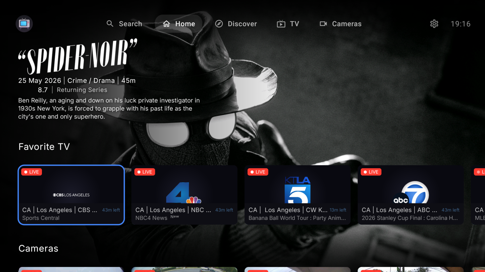 | 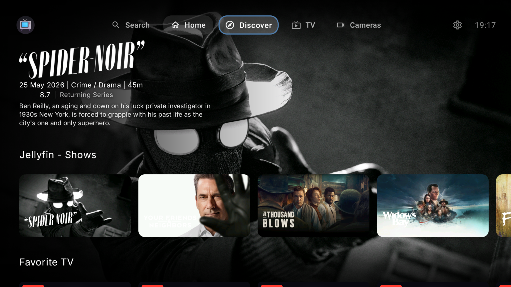 |

| Cameras row (Frigate) | Details |
|-----------------------|---------|
| 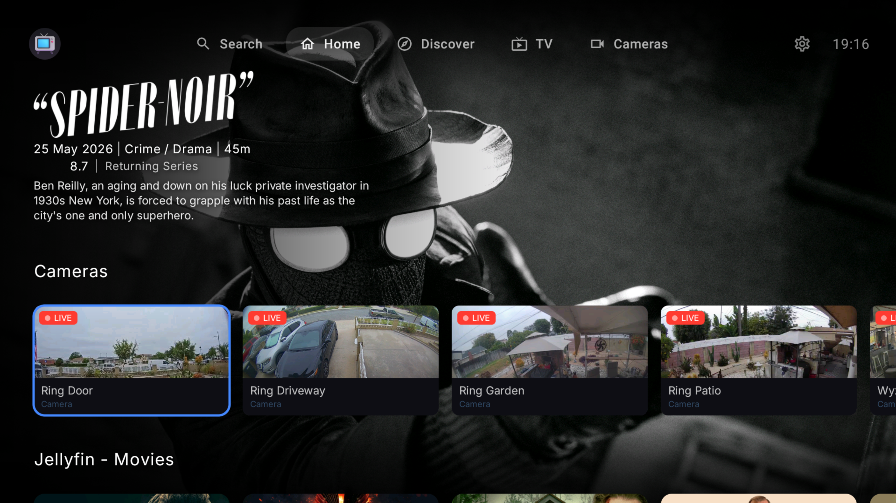 |  |

### Live TV

| TV Guide — EPG overlay | TV Guide — category sidebar |
|------------------------|---------------------------|
| 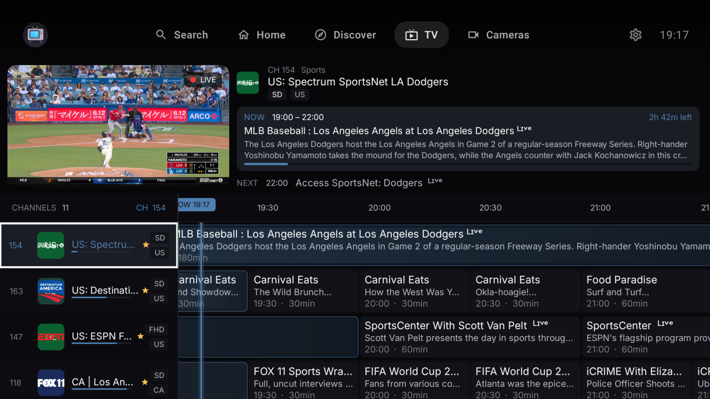 | 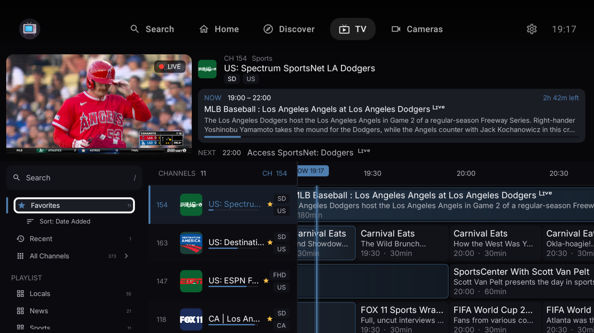 |

| Live TV mini-player (PiP) | Long-press context menu |
|--------------------------|------------------------|
| 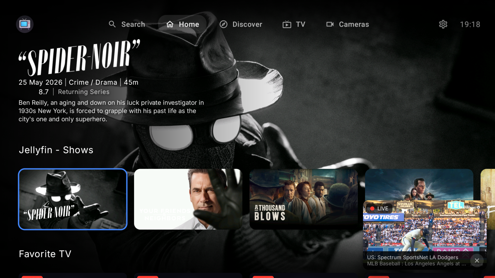 | 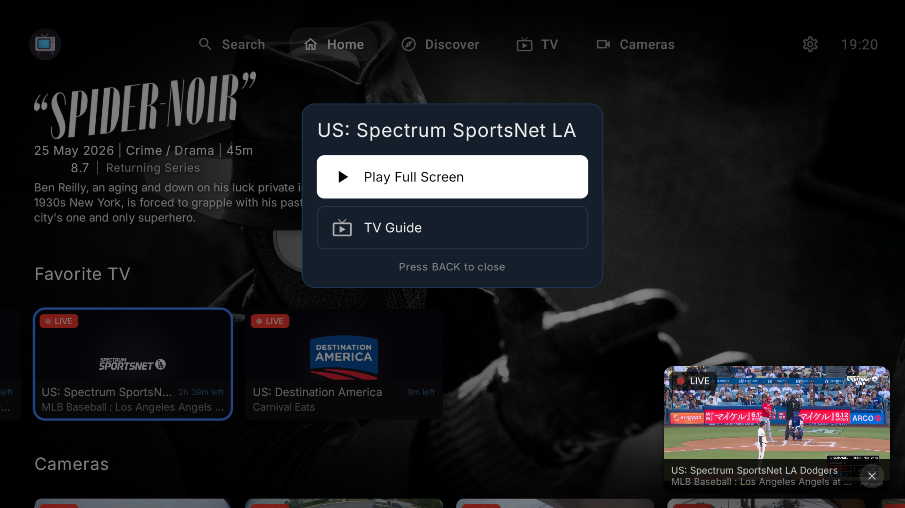 |

### Settings & Integrations

| Integration settings (webhook) | Catalog management |
|-------------------------------|-------------------|
| 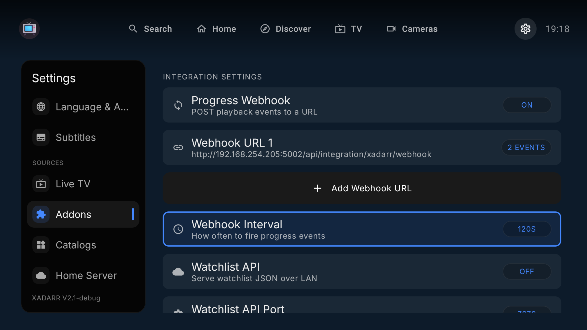 | 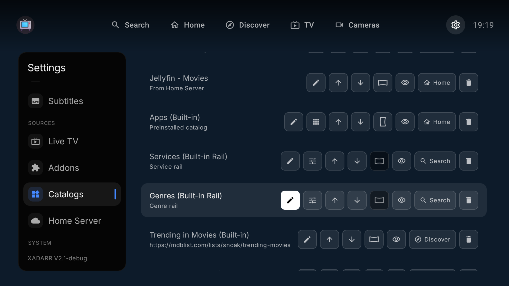 |

| Services picker | Interface settings |
|----------------|--------------------|
| 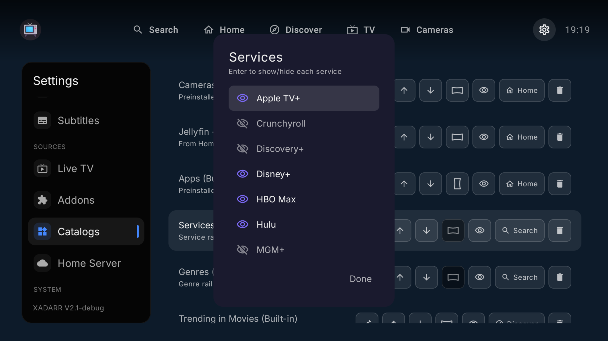 | 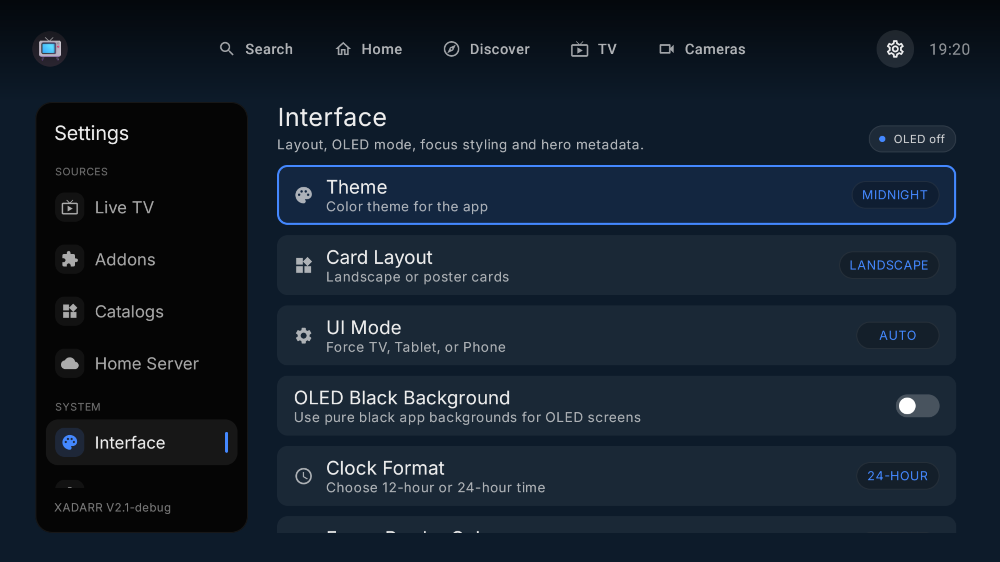 |

| Apps row manager | Collections |
|-----------------|-------------|
| 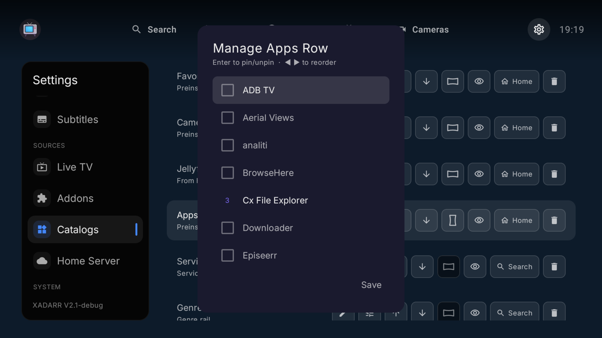 |  |

### Mobile

| Mobile home | Mobile details |
|------------|---------------|
|  | 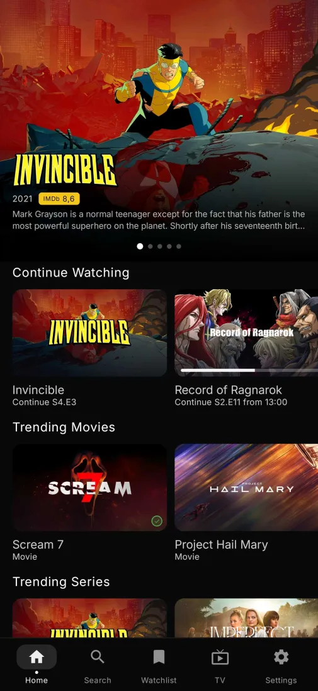 |

## Availability

Xadarr is distributed as a sideload APK. Download the latest release from [Releases](https://github.com/Vansmak/xadarr/releases).

## Build

Requirements: Android Studio or SDK command-line tools, JDK 17, Android SDK 35.

```bash
./gradlew :app:assembleSideloadDebug
./gradlew :app:installSideloadDebug

# Network ADB install
adb connect <device-ip>:5555
adb install -r app/build/outputs/apk/sideload/debug/app-sideload-debug.apk
```

Build variants: `sideload` (APK with self-update), `play` (Play Store, self-update disabled). Append `Debug`, `Staging`, or `Release`.

API keys (TMDB, Trakt) go in `secrets.properties` (copy from `secrets.defaults.properties`). For signed release builds, copy `keystore.properties.template` to `keystore.properties`. Neither file is committed.

## Content and Source Policy

Xadarr is a media browser and player for user-configured sources. It does not host, distribute, or link to third-party media. Users supply their own services, playlists, addons, and URLs and are solely responsible for complying with applicable laws.

Contributors must not submit copyrighted media, credentials, private keys, or links intended to enable unauthorized access to content.

## Privacy

See [PRIVACY.md](PRIVACY.md).

## License

Apache License 2.0. See [LICENSE](LICENSE).

## AI Disclosure

This application was developed with significant AI assistance. Contributions should still be reviewed, tested, and treated as normal source code changes.
